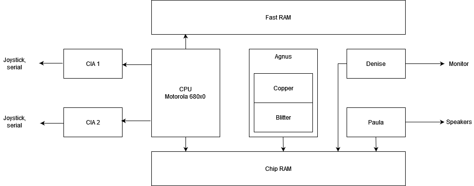
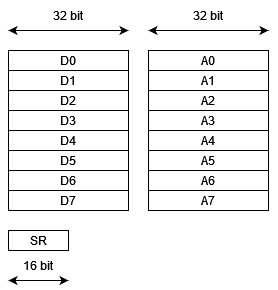

Since we want to program directly the Amiga hardware, we need to understand its architecture, which is shown in the following figure.

# CPU
The CPU is based on Motorola 680x0 family. The Amiga 500,1000 and 2000 were equipped with a 68000 running at about 7 Mhz. The Amiga 1200 was equipped with a 68EC020 at 14 Mhz. The Amiga 4000 was equipped with a 68030 or 68040 at 25 Mhz. The 68000 CPU has 32 bit registers, while the data bus and the ALU (Arithmetic Logic Unit) are 16 bits wide. The 68020,030 and 040 are full 32 bits CPUs with 32 bit data bus and ALU.  
All the 680x0 CPUs have 8 data registers, 32 bit wide, called D0 - D7. These registers can also be used as 16 or 8 bit registers. 680x0 cpu also have 8 address registers, 32 bit wide, called A0 - A7. A7 is used as stack pointer and should not be changed directly. The following picture shows the registers:

There also is a status register SR, 16 bits wide. The bottom 8 bits are known as Condition Code Register (CCR), whose bottom 5 bits are flags that are set/cleared depending on the outcome of an instruction. The following table shows the meaning of the CCR flags:
| Bit pos. | Flag | Name    | Function                                |
|----------|------|---------|-----------------------------------------|
| 0        | C    |Carry    | This flag is set when the result of an instruction creates a carry from the most significant bit |
| 1        | V    |Overflow | This flag indicates that there was an arithmetic overflow, which means that the result was either too large or too small for the destination |
| 2        | Z    |Zero     | This flag will be set when the result of the operation is zero |
| 3        | N    |Negative | This flag will be set when the result of the operation is negative |
| 4        | X    |Extend   | Holds the carry for calculations with numbers larger than 32 bits  |

# RAM
Amiga was equipped with two types of RAM memory:
* FAST Ram: could be accessed only by the CPU
* CHIP Ram: could be accessed by the custom chips or the CPU  

For our purposes, the Chip RAM is very important, because into it we will store all the graphics and sound assets used by our game.
We could store the program into Fast RAM, but only a few models had this type of memory.  
The following table shows the amount of RAM memory for various Amiga models:
| Model     | Chip RAM  | Fast RAM   |
|-----------|-----------|------------|
| A1000     | 256KB     |            |
| A500      | 512KB     |            |
| A2000     | 512KB     | 512KB      |
| A600      | 1MB       |            |
| A3000     | 1MB       | 1MB        |
| A1200     | 2MB       |            |
| A4000     | 2MB       | 2-4 MB     |

# Custom Chips
The strength of Amiga architecture were the custom chips, designed by the legendary [Jay Miner](https://en.wikipedia.org/wiki/Jay_Miner). The word "custom" means that the chips were designed specifically for Amiga and were not commercial off-the-shelf parts.
There are 3 versions of this custom chipset:
- OCS : is the Original ChipSet available on A1000,A500,A2000. It was composed by 3 chips, named Agnus, Denise and Paula.
- ECS : Enhanced ChipSet available on A600,A3000. It was composed by 3 chips, with the same names of OCS.
- AGA : Advanced Graphics Architecture available on A1200,A4000,CD32. It was composed by 3 chips, named Alice,Lisa,Paula.

## OCS features
Agnus contained the DMA controller, a coprocessor called "Copper" used to manage the screen configurations and special graphic effects, a coprocessor called "Blitter" used to transfer memory blocks.  
Denise provided the interface with the monitor. It had a palette of 4096 colors. Various video modes:
- low-resolution 320x256 (200 for NTSC), with a maximum of 32 colors
- high resolution 640x256 (200 for NTSC), with a maximum of 32 colors
- interlaced video modes 320x512 (400 for NTSC) or 640x512 (400 for NTSC)
- HAM mode capable of displaying all the 4096 colors
- hardware horizontal and vertical scrolling
- 8 hardware sprites

Paula provided four digital audio channels, each of them could play 8 bit samples with a maximum frequency of about 28Khz.
Two CIA chips provided the input/output interfaces like joystick, serial, parallel ports.

## ECS Features
This chipset added the new following features:
- video mode VGA compatible (640x480)
- super-hires mode 1280x256

## AGA Features
This chipset added the following new features:
- palette with 16.8 million colors
- increased the number of colors of lowres and hires video modes to 256
- increased width of hardware sprites to 64 px
