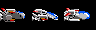

# Game Concept
In this tutorial we will create a 2D game which belongs to the **[shoot'em up](https://en.wikipedia.org/wiki/Shoot_%27em_up)** genre. A shoot'em up is a game in which the protagonist combats a large number of enemies by shooting at them while dodging their fire. We will create a clone of one of the most popular games of this genre: [R Type](https://en.wikipedia.org/wiki/R-Type).

# User stories
To specify the game mechanics, we can use the notation of *"User Stories"*, provided by the Agile development methodologies. A user story is an informal, general explanation of a software feature written from the perspective of the end user. Its purpose is to articulate how a software feature will provide value to the customer. User stories are often expressed in a simple sentence, structured as follows:  
**“As a [persona], I [want to], [so that].”**  
where:
- *persona*: represents a customer of the game (e.g., a player) or a developer in the production pipeline (e.g. a designer, a programmer) who benefits from this story;
- *want to*: the goal of the story is a feature or function in the game, tool, or production pipeline;
- *so that*: The reason describes the benefit to the customer or user when this feature or function is used (optional).

An example is:  
As a player I want to see enemies explode when I hit them with a bullet. 

# Epics
We can group together user stories into an **Epic**, which is a large body of work needed to deliver our project.  
Let's try to define the epics for our game:  
- game level
- player ship
- enemies
- bullets
- power-ups
- satellite module
- score panel
- end level boss
- title screen
- game over screen
- sound effects and music

Now we can split each epic in user stories.

| Epic                   | User Stories   |
|------------------------|----------------|
| 1 game level           | 1.1 As a player I want that my ship flies over a background scrolling horizontally to the left. |
|                        | 1.2 As a game designer I want that the game level is built using tiles and a tilemap, so that the length of the level can be more of 20 screens, using a limited amount of memory. |
| 2 player ship          | 2.1 As a player I want to control a space ship using the joystick, in 8 directions. |
|                        | 2.2 As a game designer I want that player ship is animated when it moves up and down. |
|                        | 2.3 As a game designer I want that player ship explodes when collides with background. |
|                        | 2.4 As a game designer I want that player ship explodes when collides with enemies. |
|                        | 2.5 As a game designer I want that the player has 3 lives |
|                        | 2.6 As a player I want that my ship is indestructible for a short period of time, just after losing a life. |
| 3 enemies              | 3.1 As a player I want to combat against different formations of enemies. |
|                        | 3.2 As a game designer I want that enemies move following predefined paths. |
|                        | 3.3 As a game designer I want animated enemies. |
|                        | 3.4 As a game designer I want that each enemy has an health attribute. |
|                        | 3.5 As a game designer I want that when an enemy is hit by a bullet, its health is decreased by an amount equal to the bullet damage attribute. |
|                        | 3.6 As a game designer I want that an enemy flashes when is hit by a bullet. |
|                        | 3.7 As a game designer I want that an enemy explodes when its energy is equal or less than zero. |
|                        | 3.8 As a player I want to earn score points when I destroy an enemy. |
| 4 bullets              | 4.1 As a player I want that my ship shoots different types of bullets. |
|                        | 4.2 As a game designer I want that player ship shoots a base bullet, with horizontal trajectory. |
|                        | 4.3 As a game designer I want that player ship can shoot two reflective laser beams, one which moves diagonally up and another one moves diagonally down. The laser beams are reflected by the background. |
|                        | 4.4 As a game designer I want that player ship can shoot an animated anti-aircraft laser beam, which moves horizontally |
|                        | 4.5 As a game designer I want that player ship can shoot a beam bullet, which can cause huge damages to enemies. To shoot this bullet, the player has to keep the fire button pressed in order to load a beam bar. When the beam bar is fully loaded, the player can release the fire button to shoot the beam bullet. |
|                        | 4.6 As a game designer I want that each bullet has a damage attribute, which means the damage done by the bullet to an enemy. |
| 5 power-ups            | 5.1 As a player I want to upgrade my ship collecting some power-ups objects. |
|                        | 5.2 As a game designer I want that the power-ups objects will be dropped by a given type of enemy. |
|                        | 5.3 As a game designer I want the following types of power-ups objects: reflective laser, anti-aircraft laser, satellite module. |
|                        | 5.4 As a player I want to activate a power-up object colliding with it. |
|                        | 5.5 As a game designer I want that the power-up object will disappear from screen after 10 seconds. |
| 6 satellite module     | 6.1 As a player I want that my ship can be upgraded connecting a satellite module in front of it. |
|                        | 6.2 As a game designer I want that the satellite module enters the screen from left when the player ship collects the power-up. The satellite will move toward the center of screen and will stop. |
|                        | 6.3 As a game designer I want that the satellite module disappears after 10 seconds if it's not collected by the player. |
|                        | 6.4 As a player I want that the satellite module connects in front of my ship when the ship collides with it. |
|                        | 6.5 As a game designer I want that the satellite module can destroy the enemies when it collides with them. |
|                        | 6.6 As a game designer I want that the satellite module can not be destroyed by enemies. |
| 7 score panel          | 7.1 As a player I want an information panel, at the bottom of screen, which shows the current score, number of lives, hi-score and the beam bar. |
| 8 end level boss       | 8.1 As a game designer I want that at the end of a level, the player has to destroy an end-level boss to complete the level. |
| 9 title screen         | 9.1 As a game designer I want that the game starts with a title screen, showing an animated title text, the credits informations and the flashing text:"Press fire to start". |
|                        | 9.2 As a game designer I want that when the player presses the fire button in title screen, the game screen appears and the game action starts. |
| 10 game over screen    | 10.1 As a game designer I want that when the player's lives number is less than zero, the game screen will fade out and a "Game Over" text will fade in. |
|                        | 10.2 As a game designer I want that the game over screen is visible for 10 seconds, after that the title screen will be shown. |
| 11 sounds and music    | 11.1 As a game designer I want a music in title screen. |
|                        | 11.2 As a game designer I want a game over music. |
|                        | 11.3 As a game designer I want a background music during the game action. |
|                        | 11.4 As a game designer I want sound effects for: bullet shoots, explosions,enemy hit, power up collections, game start. |

# Agile Project Management
GitHub provides some useful tools to manage your game development project using Agile methodologies.  
For each user story you can create an issue. For each issue, you can specify:
- description
- task list
- assignee
- labels (i.e. feature, documentation, bug, refactoring, the epic which refers...)
- milestone
- project

You can also add comments to the issue. When all the tasks are completed, you must close the issue.
Each issue can be associated with a project. For a project its possible to display a Kanban view:

## Roadmap
You can define some milestones. For each milestone you can specify the user stories included, a due date and a description.
In this way you can define a development roadmap.

# Graphics
For this game we will use graphic assets ripped from the original Amiga version of R-Type.
The palette will have 16 colors.
We will need 3 different palettes for:
- title screen
- game screen
- game over screen

The main graphic assets needed are listed below:
- tileset for the level map

- spritesheet for player ship

- spritesheet for enemies

- spritesheet for bullets
- spritesheet for power-ups
- spritesheet for satellite module
- spritesheet for beam bar
- font for score
- spritesheet for lives icons
- spritesheet for animated title
- spritesheet for title texts
- spritesheet for game over text

All the source assets will be in IFF format. To use in the game, each asset must be converted in raw format. We will see how in a next tutorial.

# Sound
For this game we will use digital sampled music and sound effects.
We will need the following sound effects:
- base bullet shoot
- reflective laser shoot
- anti-aircraft laser shoot
- beam fire shoot
- explosion
- hit
- collection of power-up
- press fire to start

We will need the following music:
- title screen
- game background music theme
- game over

The source sound assets will be in .wav format. To use them in the game, each sound asset must be converted in raw format. We will see how in a next tutorial.